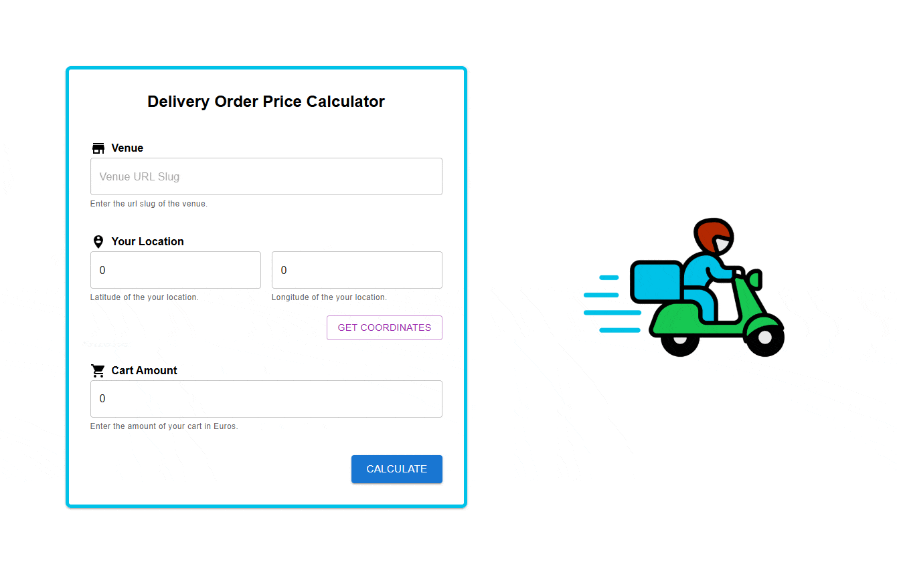

# **Preliminary Assignment for Frontend Internship**

A React + Typescript frontend application for Wolt 2025 Frontend Engineering Internship implementing Delivery Order Price Calculator (DOPC) service. Read more about the requirements of the application [here](https://github.com/woltapp/frontend-internship-2025).



## **Table of Contents**

1. [Prerequisites](#prerequisites)
2. [Getting Started](#getting-started)
3. [Usage](#usage)
4. [Environment Variables](#environment-variables)
5. [Building and Running with Docker](#building-and-running-with-docker)

## **Prerequisites**

Ensure you have the following installed on your machine:

- [Node.js](https://nodejs.org/)
- [npm](https://www.npmjs.com/)

Or

- [Docker](https://www.docker.com/) (for Dockerized setup)

## **Getting Started**

For Docker setup, jump [here](#building-and-running-with-docker).

1. Install Dependencies:

```
cd frontend
npm install
```

2. Build:

```
npm run build
```

3. Run the project:

```
npm start
```

Navigate to `http://localhost:5173`.

The project uses [playwright](https://playwright.dev/) for testing. Run the tests by first starting the project and then executing:

```
npm test
```

Linting ensures that the code adheres to a consistent style and helps catch potential bugs. The project uses [ESLint](https://eslint.org/) for linting. To check for linting, use the following:

```
npm run lint
```

The project can be excuted in development mode by using the following:

```
npm run dev
```

## **Usage**

Following inputs are required by the application to compute delivery price.

| Endpoint         | Description                                              |
| ---------------- | -------------------------------------------------------- |
| `Venue slug`     | The venue slug, for which to calculate delivery pricing. |
| `User latitude`  | The user's latitude.                                     |
| `User longitude` | The user's longitude.                                    |
| `Cart value`     | Value of the shopping cart, in Euro (EUR).               |
|                  |                                                          |

`Get Location` button is used to populate the user coordinates by trying to fetch the location based on Geolocation browser permissions. Calculate delivery price by pressing `Calculate` button after filling out the fields.

## **Environment Variables**

The project uses the following environment variables mentioned in the `.env` file at the root of the folder structure:

| Variable            | Value                                                                            | Description                   |
| ------------------- | -------------------------------------------------------------------------------- | ----------------------------- |
| `VENUE_SERVICE_URL` | `https://consumer-api.development.dev.woltapi.com/home-assignment-api/v1/venues` | _Home Assignment API_ address |

## **Building and Running with Docker**

### Getting Started

Build the image:

```
$ docker build . -t wolt-frontend
```

Run a container using the image:

```
$ docker run -p 5173:5173 wolt-frontend
```

`wolt-frontend` is the image name. Navigate to `http://localhost:5173`.

To run the project in development mode, use the following:

```
$ docker build . -t wolt-frontend:dev --target dev
$ docker run -p 5173:5173 wolt-frontend:dev
```
